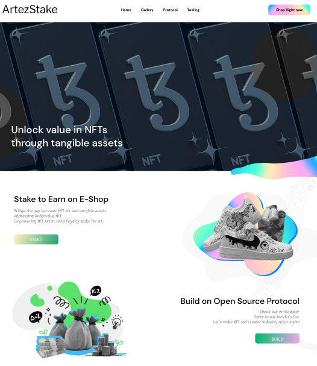
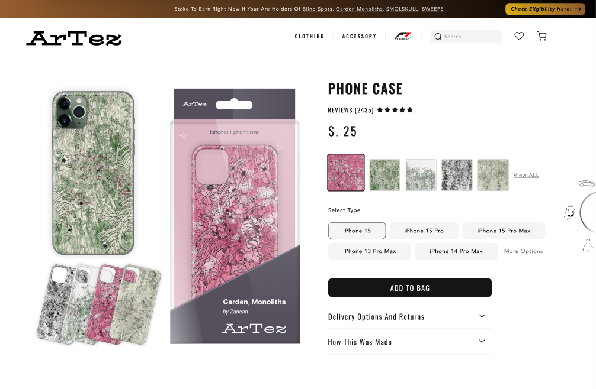
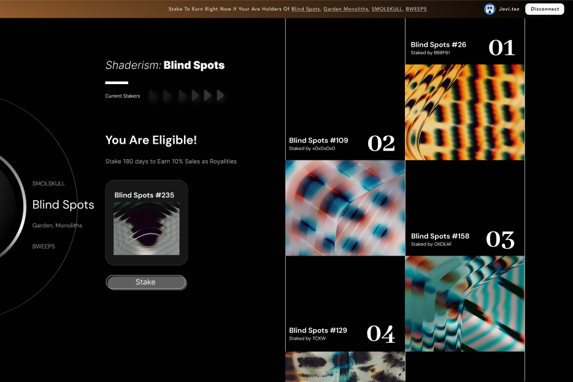
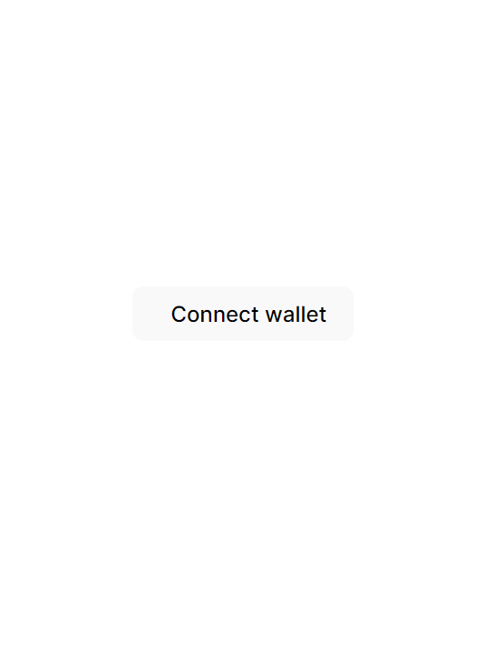
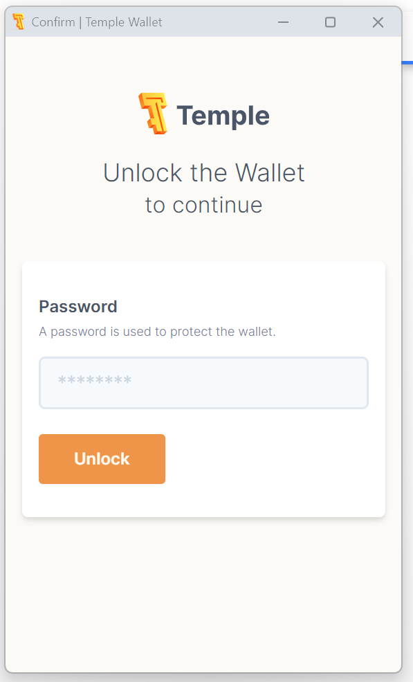
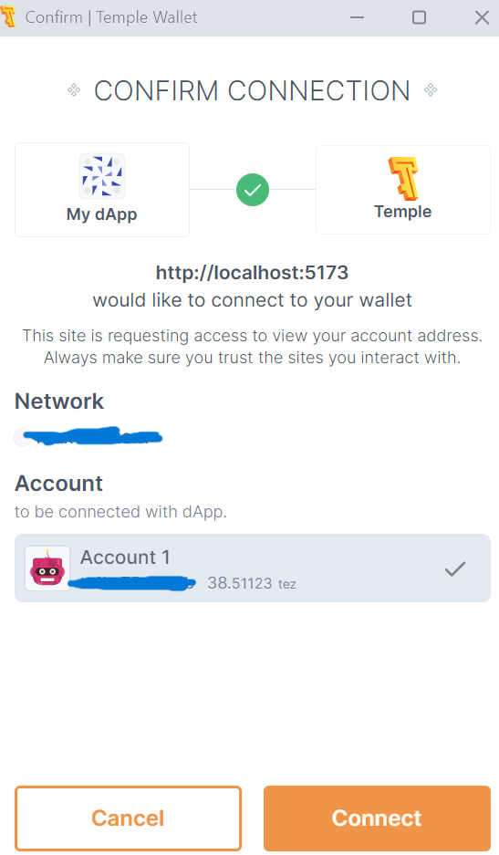
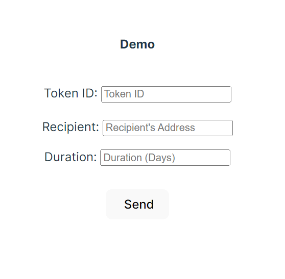

# ArtTez - Tezos Web3 Hackathon 2024

ArtTez is an NFT protocol on the Tezos blockchain which allows NFT artists to
realize value from their NFTs through real world assets.

The ArtTez protocol allows NFT owners to stake their NFTs to merchandizers for
some duration. Merchandizers can then sell products with the NFT design, and the
artist receives royalties based on these sales. At the end of the agreed time period,
the full ownership is returned to the artist.

The ArtTez smart contract was built and deployed using smartpy. This repo includes
the smartpy code that was compiled to Michelson and deployed on the Tezos blockchain.
Additionally, this repo includes a demo which allows a user to connect their wallet
and grant ownership of their NFT for some period of time.

In short: ArtTez aims to bridge the gap between NFTs and tangible assets to empower artists.

Stack: Next.js, React, Smartpy, Taquito

Run:

`cd my-dapp`  
`npm run dev`  

## Frontend UI (wireframe)

### Front page
  

### Products
  
  
  

### Stake your NFT
  

## Protocol Demo

### Step1: Click connect wallet  
  

### Step2: Connect your wallet  
  

### Step3: Confirm your wallet connection  
  

### Step4: Demo transfer  
  